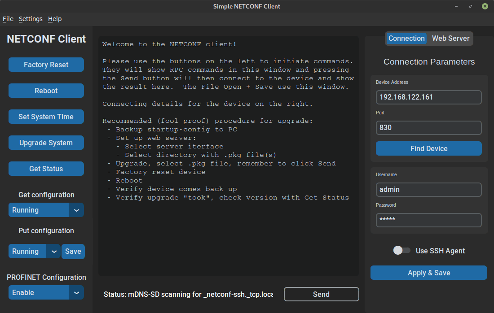
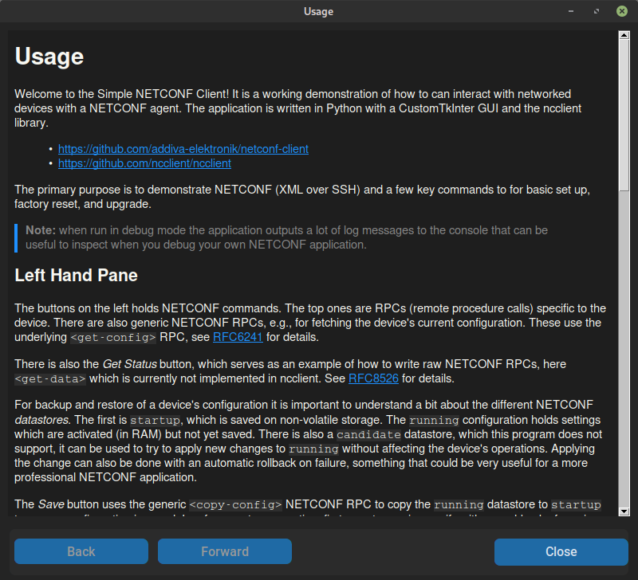

# Simple NETCONF Client 

This application is a NETCONF client with a user-friendly UI, built with
Python and customtkinter library, for interacting with NETCONF-enabled
devices.



For help, see the built-in [Usage Instructions](usage.md).



## Cloning

Use git to clone this repository (the green <> Code button):

```bash
git clone https://github.com/addiva-elektronik/netconf-client.git
```

## Setup

It is recommended to use Python3 virtual environment for 3rd party
software.  This ensures proper versions of all dependencies are used,
without leaking over to other programs.

Set up venv and source `activate`.  The following example works on
Linux, verified on [Linux Mint]():

```
~/src/netconf-client(main)$ python -m venv .venv
~/src/netconf-client(main)$ source .venv/bin/activate
```

On Windows, example from Windows 10 running [Git Bash (MINGW64)][2]:

```
~/src/netconf-client(main)$ python -m venv .venv
~/src/netconf-client(main)$ source .venv/Scripts/activate
```

> Other combinations of operating system and IDE are of course also
> possible.  E.g., running from <cmd>cmd.exe</cmd>, use `activate.bat`

Calling the <cmd>python</cmd> command from now on (in this terminal)
uses the `.venv/bin/python`, same with the <cmd>pip</cmd> command which
we'll now use to install the requirements:

```
~/src/netconf-client(main)$ pip install -r requirements.txt
...
```

> When done, call `deactivate`, or `deactivate.bat` to "detach" from the
> venv.

#### IMPORTANT INFORMATION!

The program has pre-programmed buttons to enable/disable PROFINET.  This
requires two custom files to be added to the root folder:

 - `enable-profinet.xml`
 - `disable-profinet.xml`

These files should contain the NETCONF xml configuration to enable and
disable PROFINET on the target device.


## Running and Building

Application can be run on Windows, Linux & MacOS.

### Running app

``` 
~/src/netconf-client(main)$ python main.py
```

### Building .exe for Windows

``` 
pyinstaller main.spec
```

## Contributing

Pull requests are welcome. For major changes, please open an issue first
to discuss what you would like to change.

## License

The project is available for free, under the open source [MIT][3]
license.

[1]: https://linuxmint.com/
[2]: https://gitforwindows.org/
[3]: https://choosealicense.com/licenses/mit/
